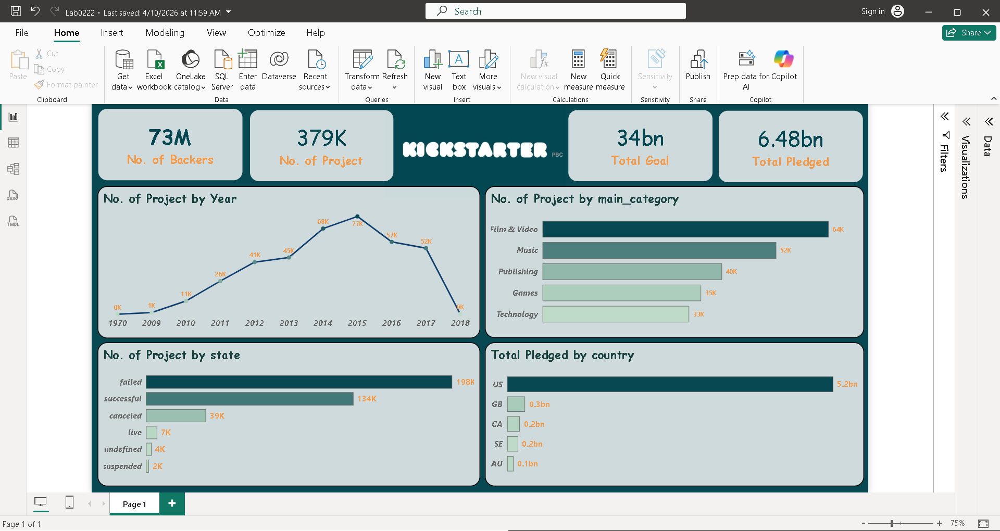

# 🚀 Kickstarter Dashboard

Power BI · Kick_starter.pbix · Dataset: 2016–2018

## 📋 Summary

This Power BI dashboard provides a high-level analytical view of **379K Kickstarter projects** spanning 1970–2018, backed by **73 million backers** with a total pledge of **$6.48 billion** against a **$34 billion** combined goal.

## 📊 Key Metrics

73M --> No. of Backers

379K --> No. of Projects

34bn --> Total Goal

6.48bn --> Total Pledged

## 💡 Highlights

- 🎬 **Film & Video** leads all categories with 64K projects, followed by Music (52K) and Publishing (40K).
- 📅 Project volume **peaked in 2015** at 77K, then declined sharply through 2018.
- ✅ The overall **success rate is \~35%** (134K successful out of 379K total). ⚠ 198K failed
- 🇺🇸 The **US dominates funding** at $5.2bn pledged — roughly 80% of global totals.

## 🛠️ Tools & Data

| Item | Detail |
| --- | --- |
| Tool | Microsoft Power BI Desktop |
| File | Lab0222.pbix |
| Dataset | Kickstarter Projects (1970–2018) |
| Theme | Teal / orange Kickstarter palette |
