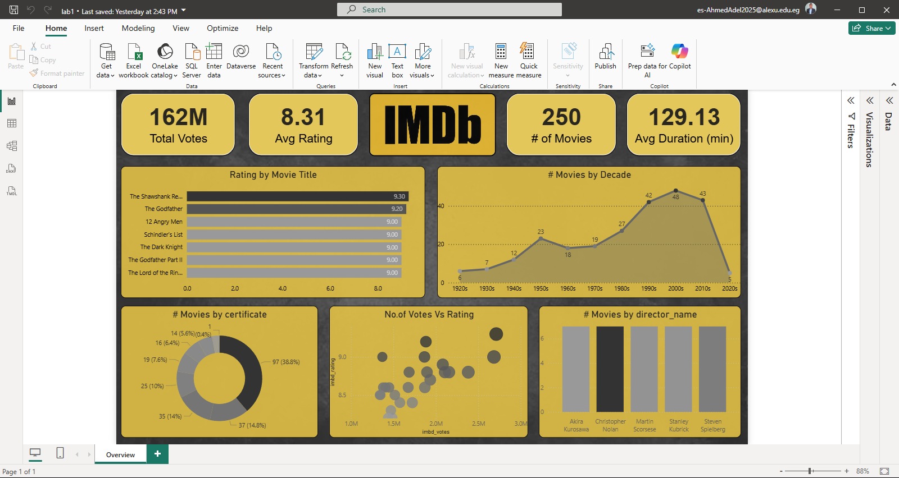
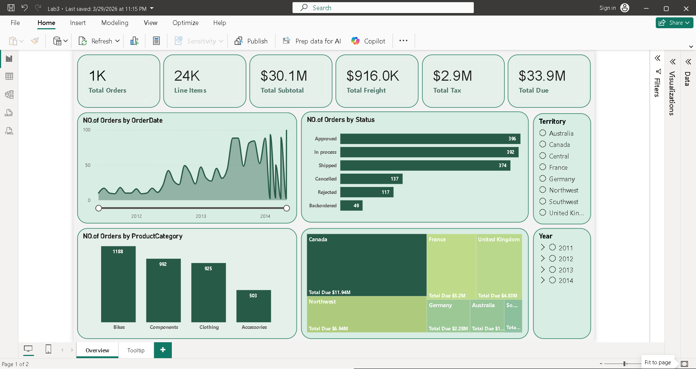
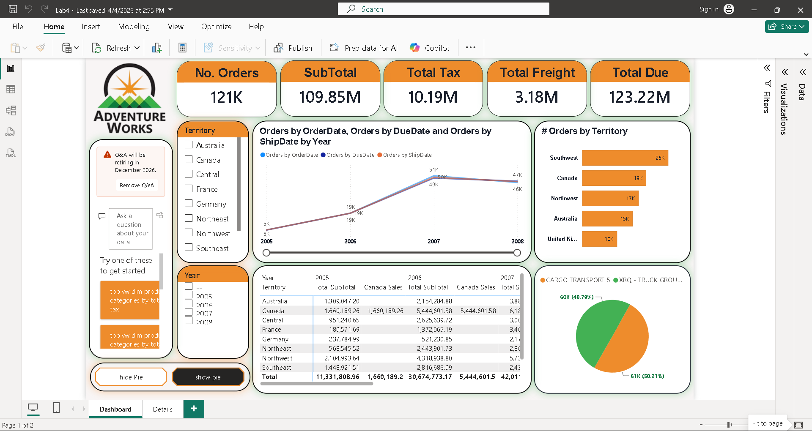

# 📊 Power BI Learning Labs

A series of four hands-on Power BI projects built for **learning and applying** data visualization skills — from importing and modelling data to crafting interactive dashboards across diverse real-world datasets.

> 🛠 **Tool:** Microsoft Power BI Desktop &nbsp;|&nbsp; 🎯 **Level:** Beginner → Intermediate &nbsp;|&nbsp; 📁 **Labs:** 4

---

## 🎓 Skills Practiced

| Category | Skills |
|---|---|
| Data | Import, Modeling, DAX Measures |
| Charts | Bar, Column, Line, Area, Scatter, Pie, Donut, Treemap |
| Layout | KPI Cards, Slicers, Filters, Multi-page Reports, Tooltips |
| Advanced | Time Intelligence, Territory Analysis, Interactive Buttons, Q&A Panel |
| Design | Custom Themes, Color Palettes |

---

## 📋 Labs Overview

| # | Dashboard | Dataset | Focus Area | Key Metric |
|---|---|---|---|---|
| 1 | 🎬 IMDb Movies | IMDb Top 250 | Ratings & genre analysis | 8.31 Avg Rating |
| 2 | 🚀 Kickstarter | Kickstarter Projects (1970–2018) | Crowdfunding trends | $6.48bn Pledged |
| 3 | 🛒 Sales | Sales Orders | Order pipeline & revenue | $33.9M Total Due |
| 4 | 🏔️ Adventure Works | AdventureWorks DB | Territory & logistics | $123.22M Total Due |

---

## 🎬 Lab 1 — IMDb Movies Dashboard

**File:** `lab1.pbix`



Explores the IMDb Top 250 movies dataset to practice building a visually themed dashboard. Focuses on ranking visuals, decade-based trend analysis, and combining multiple chart types in a cohesive layout.

**Key Metrics**

| Metric | Value |
|---|---|
| Total Votes | 162 Million |
| Avg Rating | 8.31 |
| No. of Movies | 250 |
| Avg Duration | 129.13 min |

**What You'll Learn**
- Horizontal bar chart for ranking
- Line/area chart for decade trends
- Donut chart for category distribution
- Scatter plot for votes vs. rating
- Applying a custom dark gold theme

---

## 🚀 Lab 2 — Kickstarter Projects Dashboard

**File:** `Lab0222.pbix`


Analyzes 379K Kickstarter campaigns from 1970–2018 to explore project success rates, category popularity, funding pledges, and geographic distribution. Introduces working with large, multi-dimensional datasets.

**Key Metrics**

| Metric | Value |
|---|---|
| No. of Backers | 73 Million |
| No. of Projects | 379K |
| Total Goal | $34 Billion |
| Total Pledged | $6.48 Billion |

**What You'll Learn**
- Line chart for year-over-year trends (peak: 2015 with 77K projects)
- Bar chart breakdown by category and project state
- Geographic aggregation by country
- Calculating and visualizing success rate (~35%)

---

## 🛒 Lab 3 — Sales Dashboard

**File:** `Lab3.pbix`



Applies sales order data to build an executive-style dashboard covering order status pipelines, product category performance, and territory revenue. Introduces treemaps and multi-page report design.

**Key Metrics**

| Metric | Value |
|---|---|
| Total Orders | 1K |
| Line Items | 24K |
| Total Subtotal | $30.1M |
| Total Freight | $916K |
| Total Tax | $2.9M |
| Total Due | $33.9M |

**What You'll Learn**
- Treemap for territory revenue (Canada leads at $11.94M)
- Order status bar chart (Approved 396 · Cancelled 137)
- Product category column chart (Bikes: 1,188 orders)
- Time series area chart (2012 → 2014 growth)
- Multi-page report with a **Tooltip** page

---

## 🏔️ Lab 4 — Adventure Works Dashboard

**File:** `Lab4.pbix`



The most advanced lab — built on the classic AdventureWorks database. Covers multi-date-dimension tracking, carrier distribution analysis, a cross-tab territory sales table, and interactive UI elements.

**Key Metrics**

| Metric | Value |
|---|---|
| No. of Orders | 121K |
| SubTotal | $109.85M |
| Total Tax | $10.19M |
| Total Freight | $3.18M |
| Total Due | $123.22M |

**What You'll Learn**
- Multi-line chart comparing Order / Due / Ship dates (peak: 2007 at 51K)
- Territory bar chart (Southwest leads at 26K orders)
- Cross-tab table with SubTotal by territory and year
- Pie chart for carrier split (Cargo Transport 5 vs. XRQ Truck Group)
- Interactive **hide/show Pie** button toggle
- **Q&A natural language panel** for ad-hoc exploration

---

## 📁 Project Structure

```
/
├── lab1.pbix                  # IMDb Movies
├── Lab0222.pbix               # Kickstarter
├── Lab3.pbix                  # Sales
├── Lab4.pbix                  # Adventure Works
├── README.md
└── images/
    ├── lab1_imdb.png
    ├── lab2_kickstarter.png
    ├── lab3_sales.png
    └── lab4_adventureworks.png
```

---

## 🚀 Getting Started

1. Install [Power BI Desktop](https://powerbi.microsoft.com/desktop/) (free).
2. Open any `.pbix` file to explore the report.
3. Use the **Filters** pane to slice by territory, year, or category.
4. Try modifying visuals or DAX measures to apply what you learn.

---

*Built for educational purposes — learning and applying Power BI concepts.*
